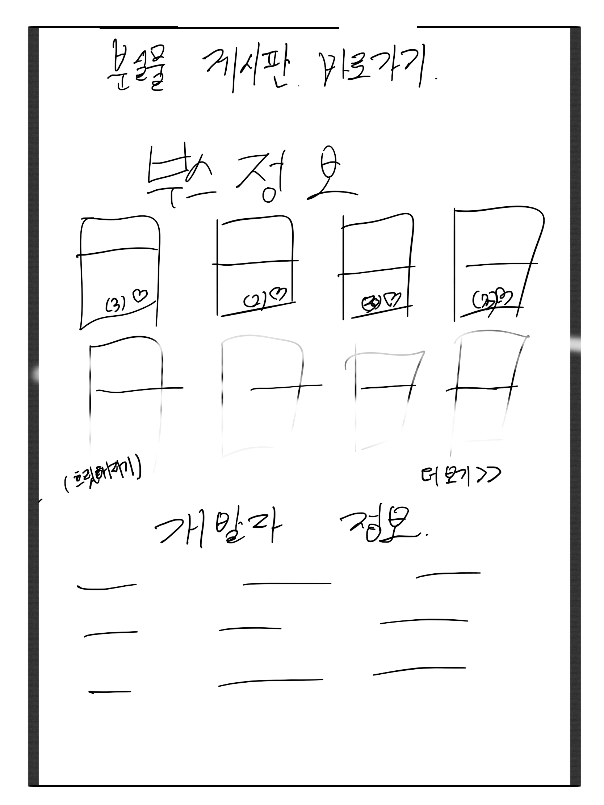

	
		

<h2 align="center">KNU_Festival 강원대 축제 소개 서비스</h2>

#### 개발 목표

- 강원대학교 멋쟁이사자처럼 6기가 직접 개발하는 서비스를 만든다.
- 축제를 이용하는 모든 사람들에게 편의성을 증진시켜 줄 서비스를 개발한다
- 간단한 GitHub 활용을 통해 협업을 경험한다.

#### 개발 범위

- 춘천 강원대학교에서 9월17일(월)~9월19일(금)까지 진행되는 축제 정보 안내 서비스
- 축제 전체 일정을 일별로 제공한다. 
- 축제 연예인 라인업 정보를 제공한다.
- 축제 중 작은 이벤트들에 대한 정보를 제공한다. 
- 축제 중 학과별 주점 위치 및 주점 컨셉을 제공한다. 
- 분실물 게시판 제공
- 축제기간 자유롭게 대화를 작성할 수 있는 메시지판을 카카오톡 플러스친구 및 Pusher를 활용하여 제공한다.
- 축제기간 주점이나 부스에 대한 리뷰 및 좋아요 기능을 제공한다.

#### 개발 포지션

* Front-end: 하준혁, 손명진, 고상희, 박귀열, 박수민, 이상은

* Back-end: 홍석준, 서현석

* Designer: 고유미, 이인하

#### 초기 셋팅

#### 사이트 도안

#### 

### 실제 진행도

#### 안내 사항

본 README.md는 '멋쟁이사자처럼 서울시립대학교' 를 참고하였습니다.

무단으로 상업적 및 비상업적으로 배포 및 이용할 경우 적발 시에 민,형사상 처벌을 받을 수 있습니다.
